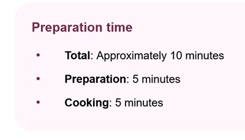
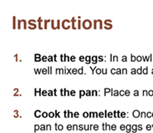

# Frontend Mentor - Recipe page solution

This is a solution to the [Recipe page challenge on Frontend Mentor](https://www.frontendmentor.io/challenges/recipe-page-KiTsR8QQKm). Frontend Mentor challenges help you improve your coding skills by building realistic projects.

## Table of contents

- [Overview](#overview)
  - [The challenge](#the-challenge)
  - [Screenshot](#screenshot)
  - [Links](#links)
- [My process](#my-process)
  - [Built with](#built-with)
  - [What I learned](#what-i-learned)
  - [Continued development](#continued-development)
  - [Useful resources](#useful-resources)
- [Author](#author)
- [Acknowledgments](#acknowledgments)

## Overview

### Screenshot


### Links

- Solution URL: [Add solution URL here](https://github.com/azizmech/recipe-page-main/tree/main)
- Live Site URL: [Add live site URL here](https://azizmech.github.io/recipe-page-main/)

## My process

### Built with

- Semantic HTML5 markup
- CSS custom properties
- CSS Grid
- Mobile-first workflow

### What I learned

- Using custom design for coloring list bullets :

```html
<ul class="ingredients__list">
  <li class="ingredients__item">...</li>
</ul>
```

```css
.preparation__item::before {
  content: "•";
  font-size: 1.5rem;
  color: var(--color-dark-raspberry);
  display: inline-block;
  ...;
}
```



- Using marker element for coloring the ordered list:

```html
<ol instruction__list>
  <li class="instruction__item">...</li>
</ol>
```

```css
.instruction__item::marker {
  color: var(--color-nutmeg);
  font-weight: 700;
}
```



### Continued development

Adding a navigation bar make this page more flexible.

### Useful resources

- [W3schools](https://www.w3schools.com/howto/howto_css_bullet_color.asp) - This helped me for solve the problem of how to color Ordered list bullet.
- [W3.org](https://www.w3.org/Style/Examples/007/color-bullets.en.html) - This is an amazing article which helped me finally understand how to custom list.

## Author

- GitHub - [azizmech](https://github.com/azizmech)
- Frontend Mentor - [@azizmech](https://www.frontendmentor.io/profile/azizmech)
- LinkedIn - [@azizmech-dev](https://www.linkedin.com/in/azizmech-dev/)

## Acknowledgments

This is where you can give a hat tip to anyone who helped you out on this project. Perhaps you worked in a team or got some inspiration from someone else's solution. This is the perfect place to give them some credit.
